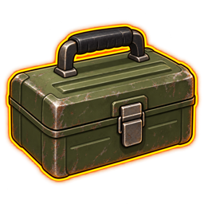

# PZ Survivor Toolkit



A Lua mod for Project Zomboid Build 42. Highlights loose items on the ground to make them easier to find in grass and clutter. Also makes zero protection changes neutral grey in the clothing Wear menu; gains and losses keep the game's configured colours. Fixes multiplayer auto-drink preferences shared accidentally through the host's saved options.

## Installation

1. Clone or download [this repository](https://github.com/AlexRedby/pz-survivor-toolkit).
2. Copy the `PZSurvivorToolkit` folder into your `Zomboid/mods` directory, keeping its `common` and `42` subfolders intact.
3. Enable **PZ Survivor Toolkit** in the game's Mods menu and for the save you want to play.

The usual mod directory is `~/Zomboid/mods` on macOS/Linux or `%UserProfile%\Zomboid\mods` on Windows. No additional mod dependency is required.

For our selected multiplayer mod set, see the [server/client installation steps](MOD_INSTALL.md), [mod list](USEFUL_MODS.md) and [ordered server INI](SurvivorQoL-selected.ini). Toolkit must be installed manually on the server and every client; it has no Workshop item.

## Controls

- Click **Items: ON / Items: OFF** at the bottom of the left sidebar to toggle highlighting.
- **F8** is the default optional shortcut. Change it using **Options > Mods > PZ Survivor Toolkit > Toggle key**.
- **Options > Mods > PZ Survivor Toolkit** provides the highlight switch, colour picker, toggle key binding and radius (5, 10, 15 or 20 tiles).
- **Show highlight button in sidebar** independently hides or restores the sidebar button; the shortcut and highlight setting still work while it is hidden.
- **Show zero protection changes in grey** toggles clothing comparison colours. Disable it to keep the original game colours.
- All optional feature switches default to on, are saved per client and apply without restarting. Defaults for highlighting: enabled, orange, 15-tile radius. Settings use the game's native Mod Options system. Compatibility and auto-drink bug fixes remain automatic.

## Visibility and rendering

Only loose world items on the player's current floor and within the configured radius are eligible. There is no item-type whitelist; mod-added items use the same checks.

Highlighting requires the tile to be in the character's **current field of view**, as reported by `IsoGridSquare:isCanSee`. Previously seen tiles alone are insufficient. This is stricter than everything drawn on screen: the game can still draw static items that do not receive a highlight.

The effect uses the game's native rendering. Sprite and atlas items receive an outline; some live 3D models receive a colour tint instead. The mod does not replace the renderer to force identical outlines.

Requires B42.19 or newer within Build 42. Tested in-game on **B42.21.0, macOS, single-player**, including toggling, settings, pickup and visibility changes through a window with a curtain. Two local multiplayer clients have also been tested on B42.21. Split-screen has not been verified.

The new sidebar button has behavioural checks and has been checked against the installed native UI code. Its in-game visual check is pending.

## Multiplayer auto-drink

Enable the toolkit on the server and each client. Each player controls auto-drink through the normal game options or bottle context menu. The server ignores the host's saved global auto-drink switch and keeps using each player's own networked preference, including after `reloadoptions`. The mod never saves server changes into the host's `options.ini`.

Water consumption remains native: this does not enable drinking from backpacks, mixtures or unsafe fluids. Tested on B42.21 with two local clients, both on a dedicated server and through Host. Checks cover opposing preferences, Options changes, empty/refilled bottles, server option reload and ordinary automatic drinking with bottle/thirst updates received by the client.

## CleanUI / Container Capacity Indicator

When using both mods, load them in this order: **NeatUI Framework, CleanUI, PZ Survivor Toolkit, Container Capacity Indicator**. Toolkit aligns CCI bars with CleanUI's visible inventory icons, including equipment headers, hidden equipment, expanded stacks and scaled icons. CCI keeps its own capacity calculations, colours and magazine setting. Toolkit preserves its item and container-button bars when CleanUI switches between enhanced and vanilla inventories, including icon views; it also supplies the alpha omitted by B42's native icon renderer. Without that pair, the adapter does nothing. If CCI loads before Toolkit, the adapter logs the required order and leaves its renderer unchanged.

Checked in-game on B42.21 with CleanUI 2.9.7 and CCI 1.2.0, including container reordering and 140% icon scale. Toolkit v0.1.12 passed 15 checks per English/Russian client with all 38 selected Mod IDs loaded: enhanced/vanilla details and icons, container-button bars, repeated mode switches and native item transfers. No gameplay exceptions occurred during this short localhost scenario.

## TV & Radio ReInvented

The TV/radio settings section and its adapters are registered only when TV & Radio ReInvented is active. Installed but disabled mods do not expose settings or receive patches. With TV & Radio ReInvented enabled, inventory and outside clicks keep its windows open. Close the window with the restored X button at its top right. **Options > Mods > PZ Survivor Toolkit > Keep TV/radio windows open** is enabled by default; disabling it immediately restores the original outside-click closure and hidden close button. These settings are local to each client. Native device/range cleanup remains unchanged.

On native macOS, Toolkit loads the 16 videos shipped with TV & Radio ReInvented v1.3 from the actual active mod directory. A separate `Project Zomboid.app/workshop` symlink is no longer required. Keep the complete TV mod installation, including its `.bik` files; a Lua-only copy cannot supply videos. Other platforms keep the upstream video loader. The translation fix is still needed for TV device recognition on Russian clients.

Checked on native B42.21 macOS with an English and Russian client, CleanUI, CCI and the translation fix: 18 checks per client passed with the old symlink absent. Checks cover all 16 valid video textures, synchronized VHS playback, native close-button callbacks, live option changes and out-of-range cleanup. This was a short localhost multiplayer test; other platforms remain unverified.

**Improve VHS controls** adds direct click-to-eject, tapes from native reachable loot containers and personal bags, and drag-and-drop onto the TV slot. The slot turns green for a VHS and red for an invalid drop. The selection list marks only fully watched tapes with the same checkmark as the inventory. Unfinished tapes have no marker and appear first; history belongs to the current character. Insertion uses native pickup and device actions, with ownership checked on client and server. Disable the option to restore the original TV slot/menu controls.

Toolkit v0.1.12 passed 18 native B42.21 VHS multiplayer checks per English/Russian client with all 38 selected Mod IDs loaded, including container/bag/floor pickup, direct ejection, character-specific history and checkmarks, invalid/occupied drops, stale selections, server ownership and tape conservation. No gameplay exceptions occurred during this short localhost scenario. Combined with the 15 inventory/CCI checks, each client passed 33 checks. Physical mouse/controller input and long sessions remain unverified.

## Separate experimental Network Fix

[PZ Network Fix](NetworkFix/README.md) is an independent Java mod for B42.21. Its source, build script and tests live in `NetworkFix/`; installation requires a separate build and ZombieBuddy setup. It is enabled separately from Toolkit and is not included in the default selected mod set. See its guide for installation, supported fixes and multiplayer test limits.

Network Fix 0.1.1 also cancels the old server stop timer when restarting a VHS cassette. The original engine loses playback after rapid Stop/Play; the patched B42.21 server and two English/Russian clients passed eight checks each, including synchronized controls, cassette dialogue, 62.5 XP per character and normal completion. The Java loader must run in the server process. The Windows Host launcher still needs platform verification.

## Development

Behavioural checks run with Lua 5.1 through Lupa. They use world/UI doubles; they are not visual in-game tests.

```sh
python3 -m venv .venv
.venv/bin/python -m pip install lupa
.venv/bin/python tools/run_tests.py
python3 tools/package_mod.py --check
python3 tools/package_mod.py
```

The CCI regression can also run against the installed third-party source with `--cci-source /path/to/ContainerCapacityIndicator.lua`. VHS menu, sorting, drop validation and live toggle checks run by default; add `--tv-source /path/to/RWMMergedTV.lua --native-radio-root /path/to/media/lua/client` to also exercise the native media actions and drag parser.

The optional package command writes `dist/PZSurvivorToolkit.zip` for local use. Generated archives are excluded from Git; installation only requires the source `PZSurvivorToolkit` folder.

To run the same checks against your installed game's native Mod Options implementation:

```sh
.venv/bin/python tools/run_tests.py --native-mod-options /path/to/media/lua/client/PZAPI/ModOptions.lua
```
